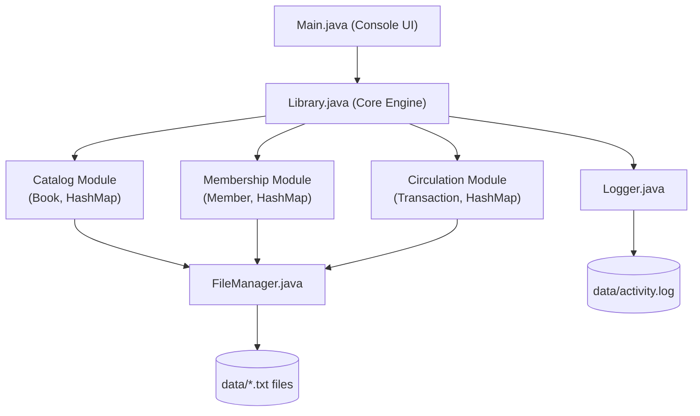
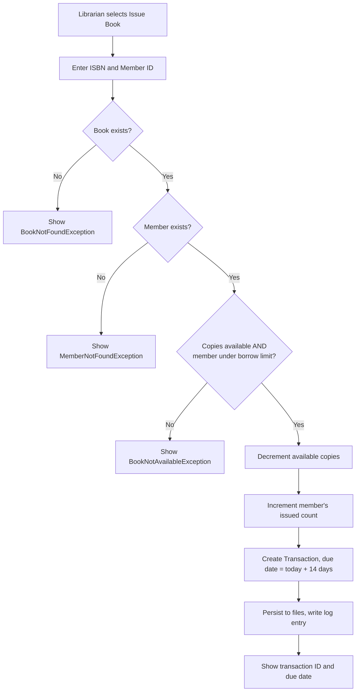
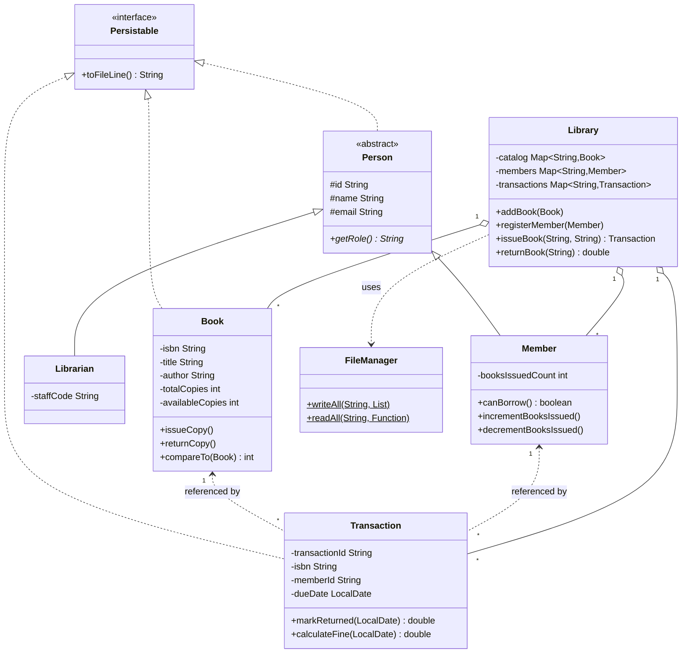
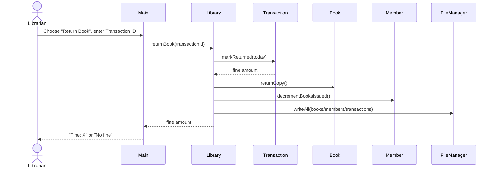

# Design & Documentation

Paste these Mermaid blocks into the report (Word/Docs, GitHub markdown, or
https://mermaid.live) to render them as images for the PDF report.

## 1. System Architecture

## 2. Process Flow — Issue Book

## 3. Class Diagram

## 4. Sequence Diagram — Return Book (with fine)

## Non-Functional Requirements Addressed

| Requirement      | How it's addressed |
|-------------------|---------------------|
| Performance        | `HashMap` lookups give O(1) access to books/members/transactions by key instead of linear scans. |
| Security           | Input validation on every menu entry point; no destructive operation (e.g. removing a member) proceeds while invariants are violated (e.g. unreturned books). |
| Reliability        | All state-changing operations immediately persist to disk, so a crash doesn't lose committed transactions. |
| Scalability        | Modules (`Catalog`, `Membership`, `Circulation`) are decoupled through `Library`, so swapping flat files for a real database later only touches `FileManager`. |
| Maintainability    | Single-responsibility classes, an interface (`Persistable`) for serialization, and generics in `FileManager` avoid duplicated I/O code. |
| Error handling     | Custom checked exceptions per failure mode, caught centrally in `Main` and shown as friendly messages, never raw stack traces. |
| Logging/monitoring | `Logger` appends a timestamped entry for every add/issue/return/error to `data/activity.log`. |
| Resource efficiency| Files are only opened for the duration of a read/write (try-with-resources), no lingering handles. |

## Note on Storage

This version uses flat text files (`data/*.txt`) rather than a relational
database, since Core Java/OOP courses typically don't require JDBC. If your
syllabus expects a database, the `FileManager` class is the only place that
would need to change — swap it for a `DatabaseManager` using JDBC, and
`Library.java` (the business logic) stays untouched. If you'd like, I can
build that JDBC version instead.
